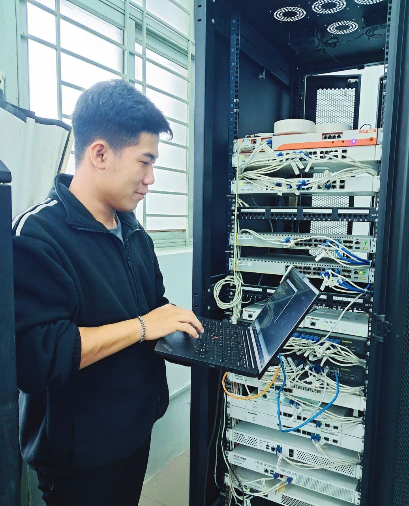

<div style="text-align:center; margin-bottom:35px;">
  
  <h1 style="margin:18px 0 6px; color:#ff0000ff; font-size:28px; font-weight:700;">Anh Tuấn</h1>
  <p style="color:#E8CC06; font-size:17px; margin:0; font-weight:500;"><strong>Cybersecurity Student – Year 3</strong></p>
  <p style="color:#7f8c8d; font-size:15px; margin:6px 0 0; font-style:italic;">
    Ho Chi Minh City University of Technology and Education (HCMUTE)
  </p>
</div>

---

## Professional Summary

Third-year **Information Security** student at **HCMUTE**, passionate about **penetration testing**, **reverse engineering**, and **secure system design**. Actively competing in national and international **CTF** and **Hackathon** events. Strong foundation in **network security**, **web application vulnerabilities**, and **cryptography**.

> *"Security is not a product, but a process."* – Bruce Schneier

---

## Education

| Degree | Institution | Duration | 
|--------|-------------|----------|
| **B.Eng. in Information Security** | Ho Chi Minh City University of Technology and Education (HCMUTE) | 2023 – 2027 (Expected) |

---

## Competitive Achievements

| Year | Event | Achievement | Team |
|------|-------|-------------|------|
| 2024 | **National CTF Championship** | **Top 10** (out of 120 teams) | HCMUTE Warriors |
| 2024 | **Secure the Future Hackathon** | **2nd Place** – Mobile App Security Track | CyberGuard |
| 2025 | **DEFCON Vietnam Qualifiers** | **Qualified for Finals** (Top 15) | Solo |
| 2023 | **PicoCTF Global Ranking** | **Top 5% Worldwide** | Individual |

---

## Technical Skills

```text
Web Security          : OWASP Top 10, XSS, SQLi, CSRF, Burp Suite, ZAP
Network Security      : Nmap, Wireshark, tcpdump, Metasploit
Reverse Engineering   : Ghidra, IDA Pro, x64dbg, Radare2
Cryptography          : AES, RSA, ECC, Hashcat, John the Ripper
Programming           : Python, Bash, C, JavaScript, Go
Platforms             : HackTheBox, TryHackMe, CTFd, VulnHub